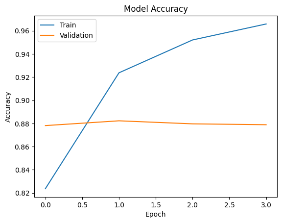

# Deep Learning Sentiment Analysis

## Project Overview

This project builds a deep learning model using **Bidirectional LSTM** to classify movie reviews as **positive or negative** based on the IMDB dataset.  
The model processes textual data using NLP techniques and learns sentiment patterns from movie reviews.

Deep learning NLP model for sentiment classification using **Bidirectional LSTM** on the **IMDB movie reviews dataset**.

## Dataset

* IMDB Movie Reviews Dataset
* Total samples: **50,000 reviews**
* Binary classification: **Positive / Negative**

## Model

* Embedding Layer
* Bidirectional LSTM
* Dropout Layer
* Dense Output Layer (Sigmoid)

## Technologies Used

* Python
* TensorFlow / Keras
* Natural Language Processing (NLP)
* NumPy
* Pandas

## Results

* Training Accuracy: **~98%**
* Validation Accuracy: **~87%**
* Test Accuracy: **~88%**

## Model Training Accuracy

## Project Structure
deep-learning-sentiment-analysis
│
├── sentiment_analysis_lstm.ipynb
├── accuracy_graph.png
└── README.md
